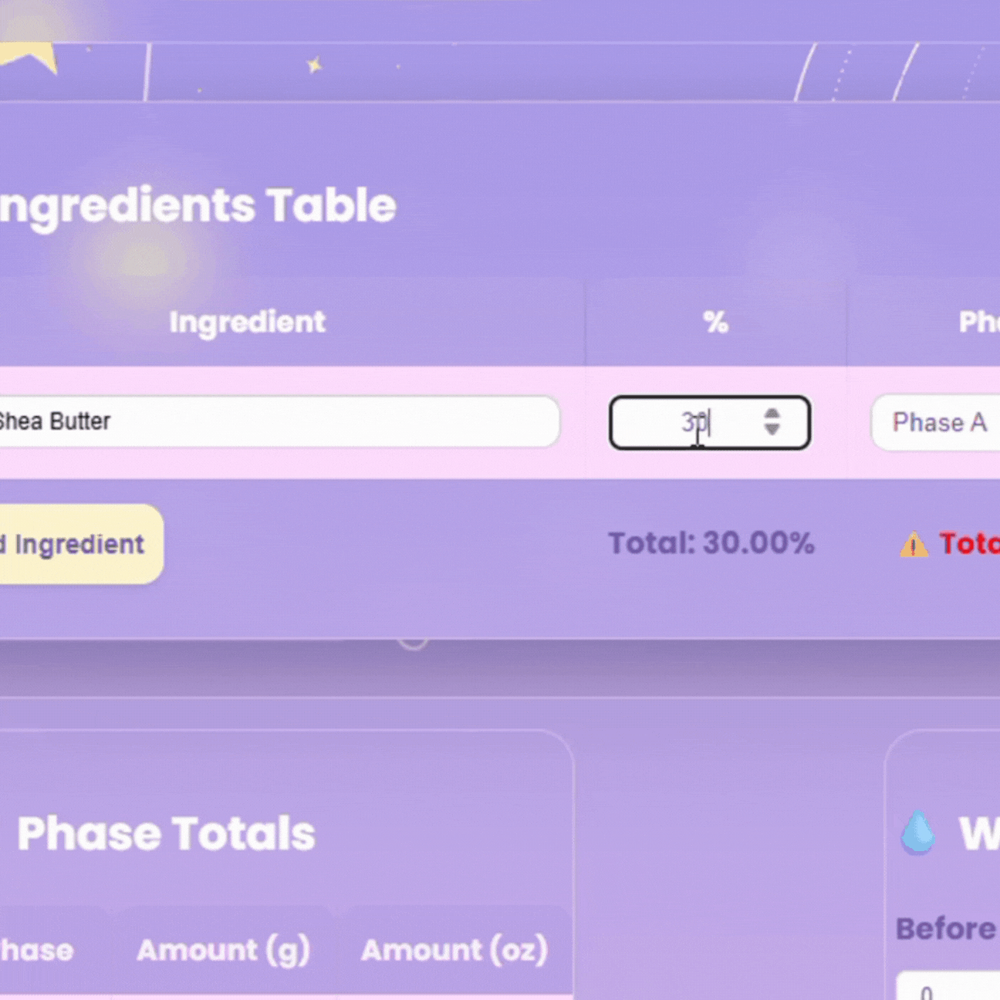
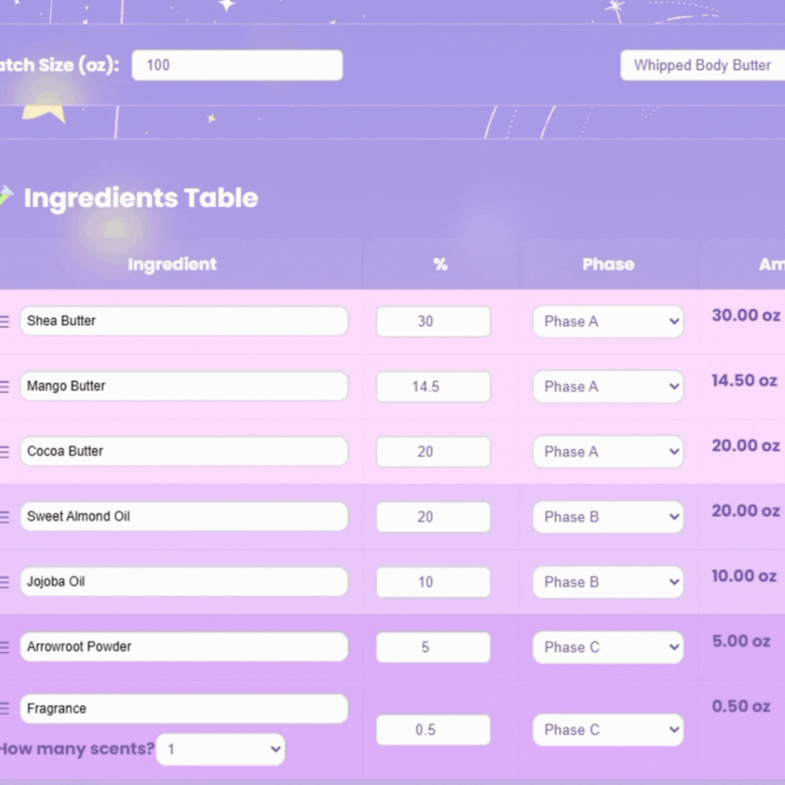
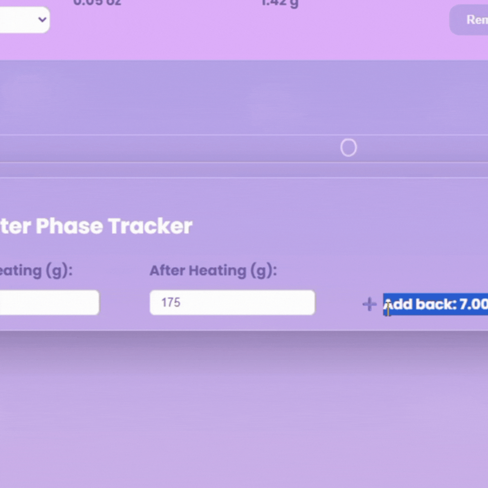
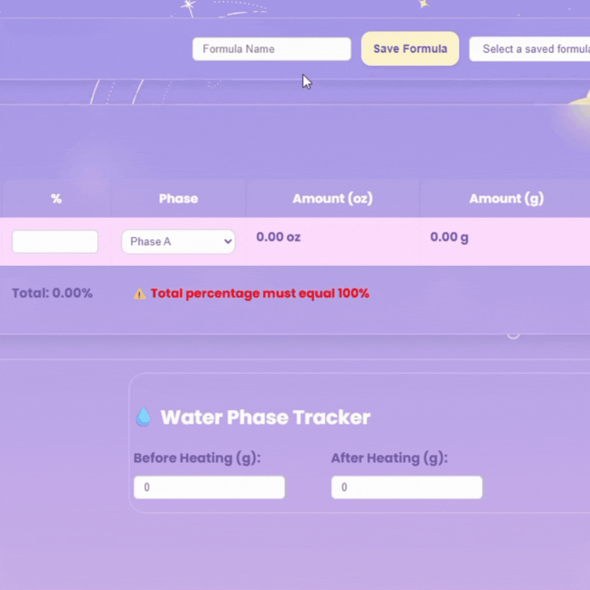
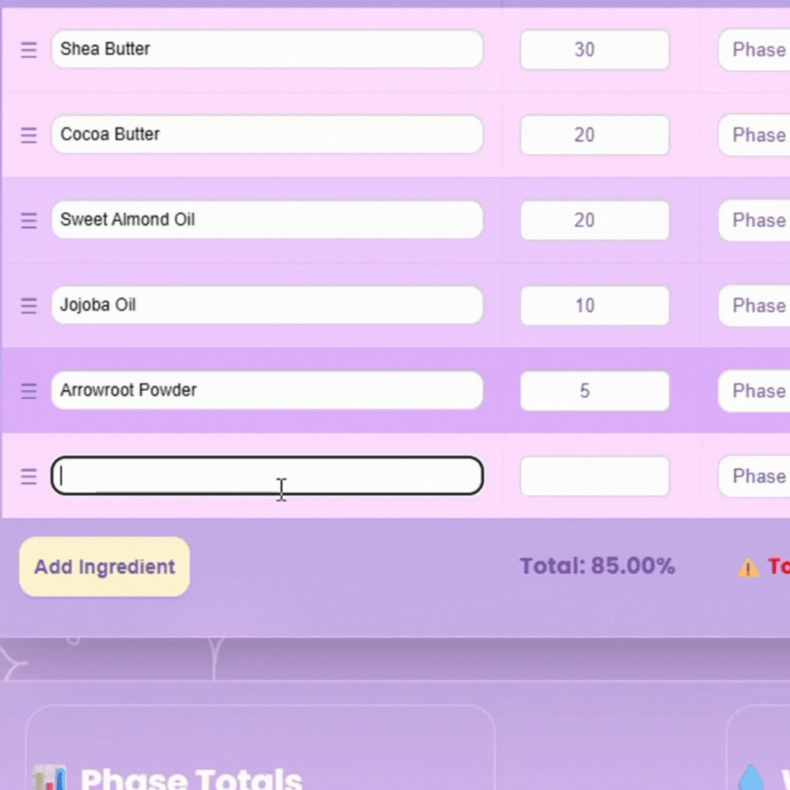
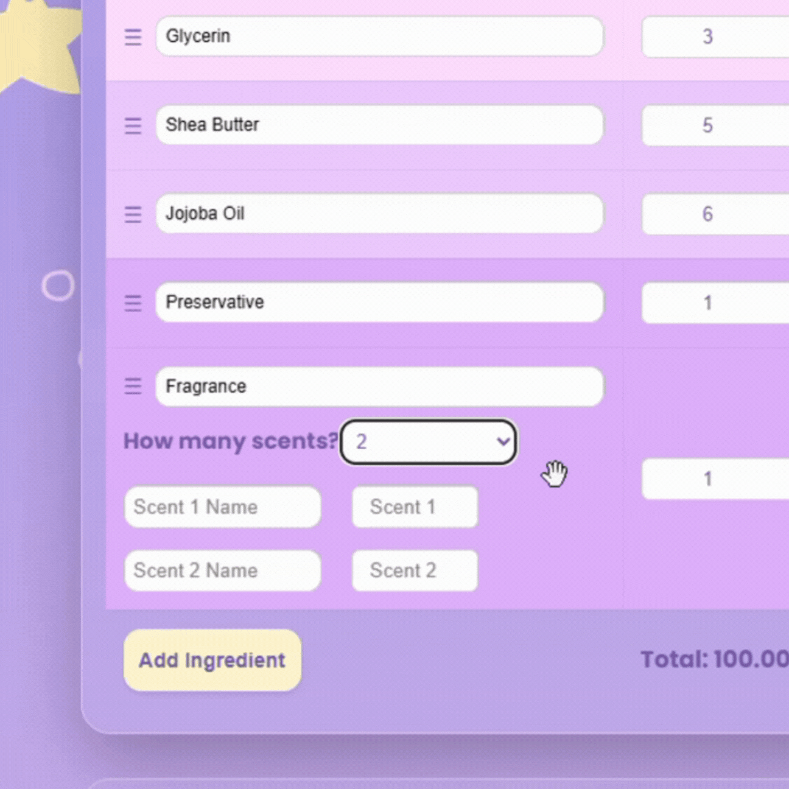
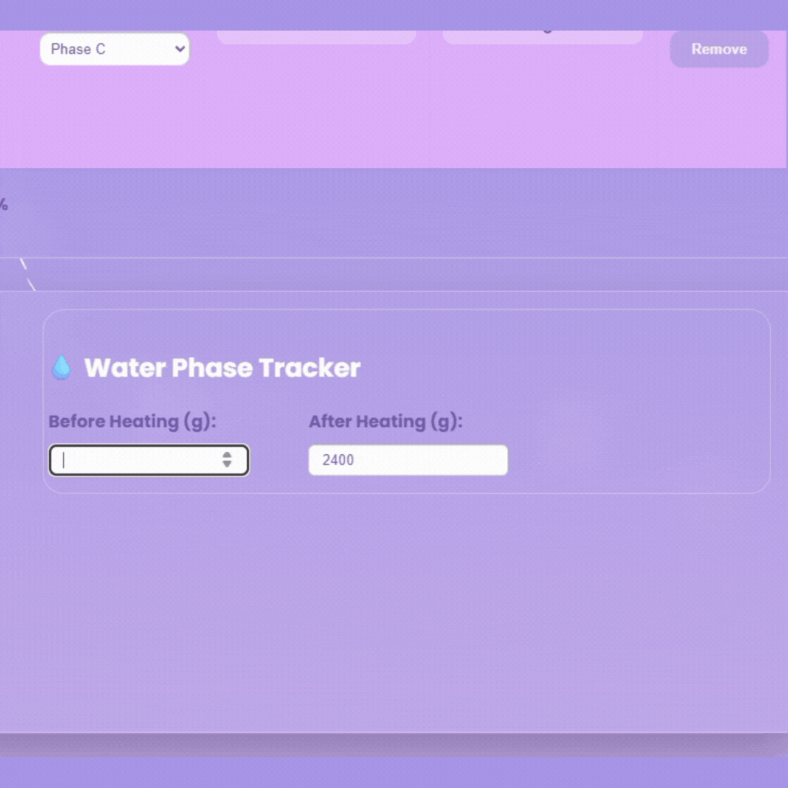
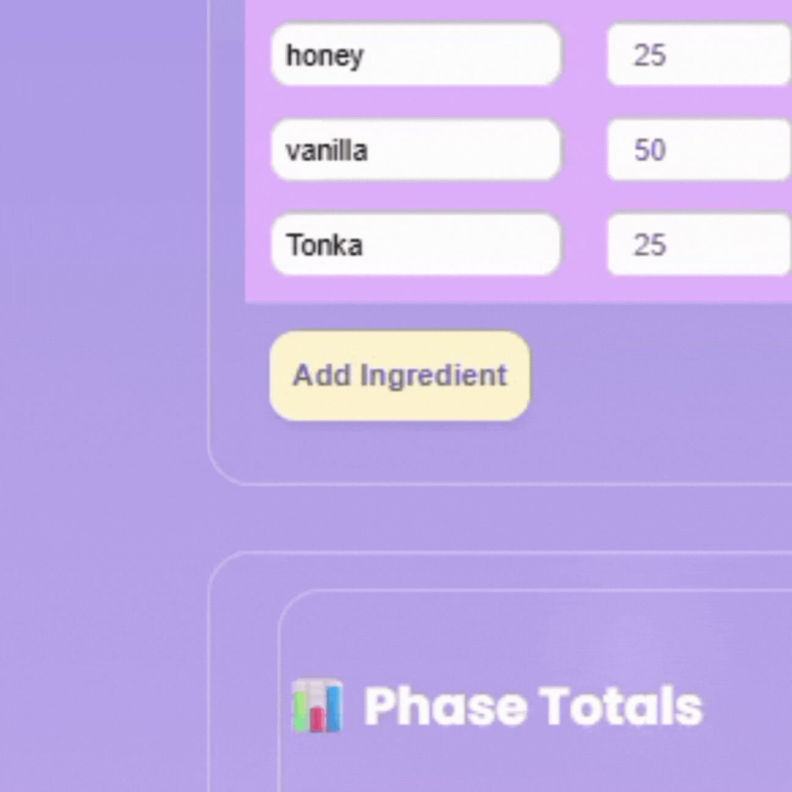

# 🌙 Moon Moisture Formula Recalculator

🎨 Built by Raemika L. | Owner of Moon Moisture LLC

Let me tell you, this app helps DIY skincare formulators quickly recalculate ingredient amounts based on batch size. Whether you're scaling up a body butter formula or adjusting percentages for smaller test batches, this app has your back.

## 📽️ App Demo (GIFs)

### 🎨 Assign Ingredient Phases


### Drag & Drop Ingredient Reordering


### 💾 Save Locally + Load Previous Formula



### 🌸 Fragrance Ratio Splitter



### 🧮 Calculated Grams/Ounces by Phase


### ✨ Add Ingredients Quickly


### ➕ Delete Ingredients Easily


---

## Features

- **Ingredient Calculator** – Instantly convert percentages into grams/oz as you build your formula  
- **Fragrance Split Tool** – Auto-split up to 3 fragrances with smart ratio presets  
- **Water Phase Tracker** – Enter before/after weights to see how much evaporated  
- **Offline Backup** – Data saves locally so you don’t lose formulas if the server’s down  


## Tech Stack

- **Frontend:** React.js, HTML5, CSS3  
- **Backend:** Node.js + Express  
- **Database:** MySQL (with localStorage fallback)  
- **Testing:** Cypress (E2E) + Selenium (manual test scripts)

## Try It Out

[Moon Moisture Formula Calculator](https://mikmikcodes.github.io/formula-calc/)


## Getting Started

### Prerequisites
- Node.js (v14 or higher)
- Git
- XAMPP or MySQL server

---

## 💾 Saving & LocalStorage

🔒 Note: Saved formulas are stored locally in your browser using localStorage. This means:

- Your saved formulas will persist on **your device** when you refresh the page.
- They are **not shared or visible** to other users.
- If you clear your browser data or switch devices, your saved formulas will be lost.

To enable shared saving across devices or users, you'd need to set up a backend with database integration.

---

### 1. Clone the Repo
```bash
git clone https://github.com/MikMikCodes/formula-calc.git
cd formula-calc
```

Or download the ZIP and unzip.

---

### 2. Database Setup

- Start XAMPP and run Apache + MySQL  
- Open [phpMyAdmin](http://localhost/phpmyadmin)  
- Create a new database: `moon_moisture_db`  
- Run the SQL schema from `/backend/db.sql` or paste manually

---

### 3. Install Dependencies
```bash
# Frontend
npm install
npm install cypress --save-dev

# backend
cd backend
npm install
cd ..
```
---

4. Start the Application
```bash
# Start both frontend and backend
npm run dev

# OR start separately:
# Terminal 1: Backend
cd backend && node server.js

# Terminal 2: Frontend  
npm start
```
Open your browser to: [http://localhost:3000](http://localhost:3000)

---

## 📁 Project Structure
```
src/
├── components/              # Reusable UI
├── services/                # API calls
├── utils/                   # Helper functions
├── App.js                   # Main app
└── index.js                 # Entry point

backend/
├── server.js                # Express server
└── db.sql                   # MySQL schema

cypress/
├── e2e/                     # Main Cypress tests
├── fixtures/                # Test data
├── support/                 # Commands/setup
├── screenshots/             # Failure captures
└── docs/testing-report.md   # Test reports

selenium-tests/
└── manual/formula-test-runner.js # Headless Selenium script
```

---

## 🧪 Running Tests

### Cypress

```bash
npx cypress open
```

### Selenium

```bash
# Install Selenium packages
npm install selenium-webdriver chromedriver

# Run test
node selenium-tests/manual/formula-test-runner.js
```


## API Endpoints

- `GET /api/formulas` – Get all formulas  
- `POST /api/formulas` – Save a formula  
- `DELETE /api/formulas/:name` – Remove a formula + versions  
- `GET /api/ingredients` – Pull your ingredient list  

## Deployment

- Hosted on GitHub Pages  
- Compatible with Heroku, Railway, etc.  
- Supports MySQL or MariaDB (or fallback to localStorage)  

---

## Testing Strategy

- **Unit Testing:** Component-level logic
- **E2E Testing:** Full workflows (Cypress)
- **Selenium:** Cross-browser manual test script
- **API Testing:** Validates database + CRUD routes
- **LocalStorage Fallback:** Ensures offline usability


## Credits

Created with 💜 by Raemika L.  
Made for companies like Moon Moisture LLC because formulas should be as smooth as your skin.

💼 Let’s connect on [LinkedIn](https://www.linkedin.com/in/raemikalugo/)


---